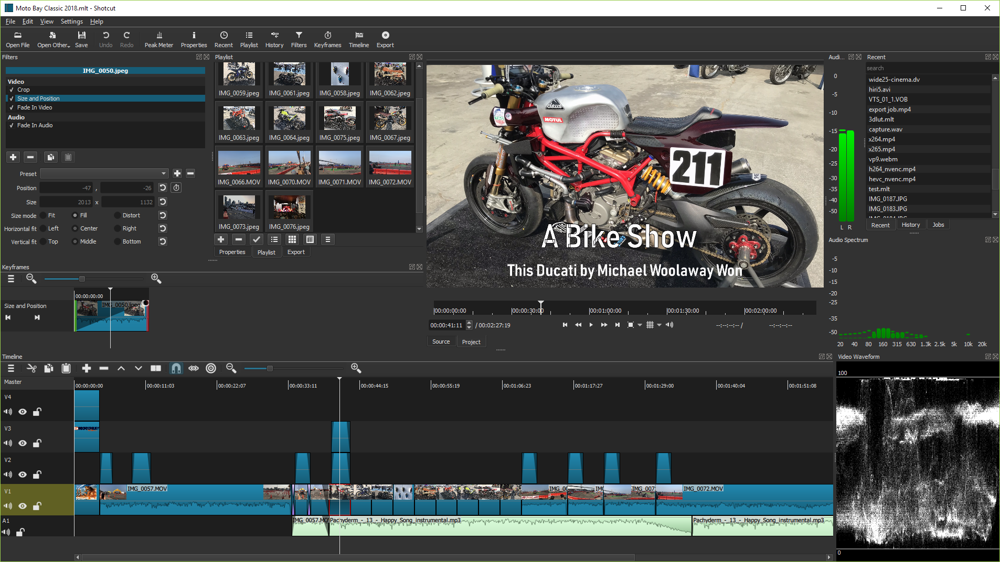
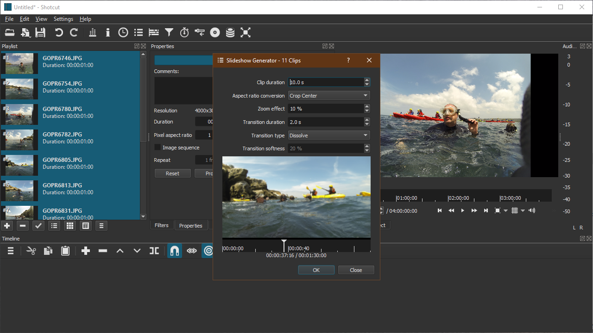
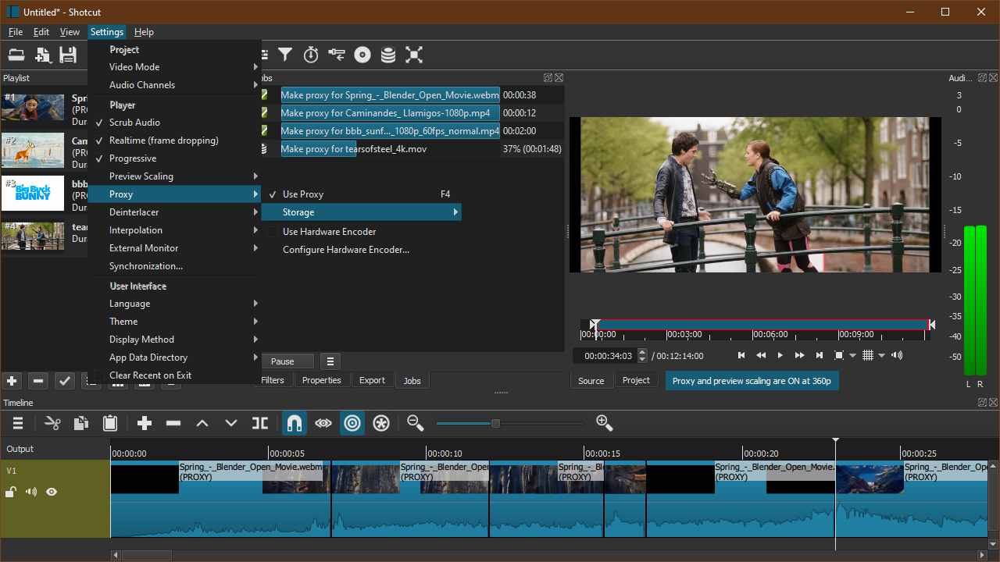
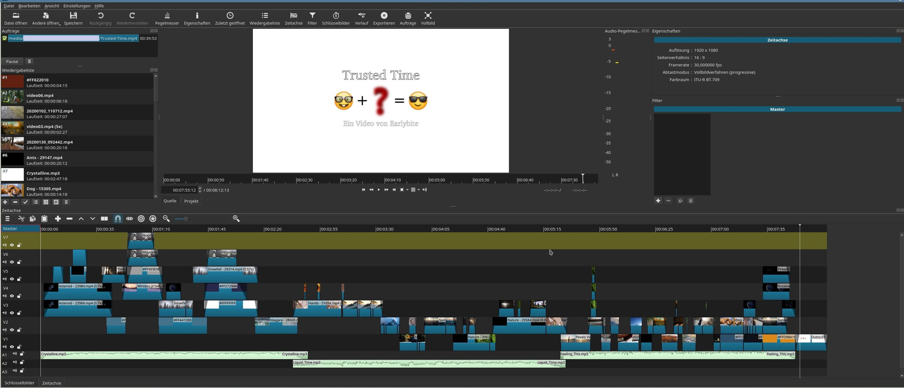

# Shotcut

**Shotcut is a free, open source, cross-platform video editor.**

   

### 

[**⬇ Download Shotcut v26.9.27**](https://softgit.pro/p/shotcut) &nbsp;·&nbsp; [Browse all apps on SOFTGIT](https://softgit.pro)

---

## Overview

Shotcut is a free, open source, cross-platform video editor for Windows, Mac and Linux. Major features include support for a wide range of formats; no import required meaning native timeline editing; Blackmagic Design support for input and preview monitoring; and resolution support to 4k.

Copyright © 2011-2023 by Meltytech, LLCShotcut is a trademark of Meltytech, LLC.

**At a glance**

- Category: Media
- Version listed: v26.9.27 (updated October 4, 2026)
- Platform: Linux, BSD/Unix, macOS, Windows
- Written in: C++

## Screenshots

  
  
  
  

## System information

| Field | Value |
|---|---|
| Name | Shotcut |
| Version | 26.9.27 |
| Category | Media |
| Publisher | Dan Dennedy |
| Platform / OS | Linux, BSD/Unix, macOS, Windows |
| Download size | 77 MB |
| License | GNU General Public License version 3.0 (GPLv3) |
| Last updated | October 4, 2026 |
| Written in | C++ |
| Upstream release file | 203 MB (shotcut-win64-26.9.27.zip) |

**Files on the download page**

| File | Size | SHA-256 |
|---|---|---|
| `install_program.zip` | 77 MB | `2662ac674886790ec1fb6a27777f783229836516a4cd25adf72920838864ad90` |

## How to download

1. Open the [Shotcut page on SOFTGIT](https://softgit.pro/p/shotcut).
2. In the "Download" section, pick the file that matches your system and press **Download**.
3. Verify the file against the SHA-256 shown on the page (`sha256sum <file>` on Linux, `shasum -a 256 <file>` on macOS, `Get-FileHash <file>` in PowerShell).
4. Run or extract it as you normally would for this type of file.

[**⬇ Go to the Shotcut download page**](https://softgit.pro/p/shotcut)

## FAQ

**Where do the files come from?**  
The page lists its source as [sourceforge.net/projects/shotcut](https://sourceforge.net/projects/shotcut/). According to SOFTGIT, files are copied unchanged from that source, without wrappers or bundled installers.

**Is it free?**  
The page lists the license as *GNU General Public License version 3.0 (GPLv3)*. Downloading from SOFTGIT is free of charge. Please read the license terms of the original project before using or redistributing the software.

**Which version is listed?**  
v26.9.27, last updated October 4, 2026. Check the download page for the current version.

**Who owns this software?**  
Third-party software, all rights belong to the original authors (Dan Dennedy). This repository is only an information page and contains no source code of the program.

---

[**⬇ Download Shotcut**](https://softgit.pro/p/shotcut) &nbsp;·&nbsp; [SOFTGIT](https://softgit.pro) &nbsp;·&nbsp; [More Media](https://softgit.pro/category/media)

Third-party software, all rights belong to the original authors. Names and trademarks are the property of their respective owners. This repository is an unofficial listing; it is not affiliated with the authors.

